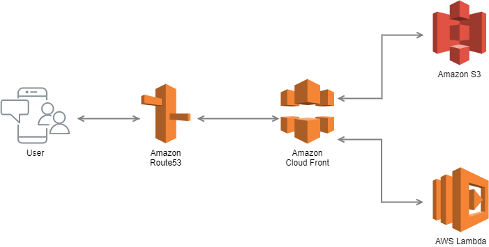

# Nuxt.js SSR Typescript on AWS Lambda@edge + S3

Nuxt.js Serverless Starter Kit

### Pre-Installed

- Nuxt.js v2.11.0
- AWS Serverless Express
- TypeScript
- TailwindCSS
- Stylus
- PWA Module
- dotenv Module

## Build Setup

Setup docker:

```bash
$ dcoker-compose build
$ docker-compose up -d
$ docker-compose exec node ash
```

Set your aws credentials in a `.env` file:

```bash
AWS_ACCESS_KEY_ID=EXAMPLE_ACCES_KEY
AWS_SECRET_ACCESS_KEY=EXAMPLE_SECRET_ACCES_KEY
AWS_DOMAIN=example.com
```

Install dependencies:

```bash
$ npm install
```

Serve develop server at localhost:3000 using Nuxt.js:

```bash
$ npm run dev
```

Prod server start with built assets:

```bash
$ npm run build
$ npm run prod
```

Deployment serverless:

```bash
$ npm run build
$ npm run deploy
```

### Architecture


